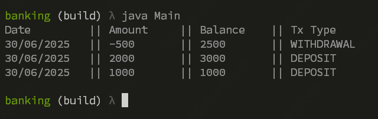
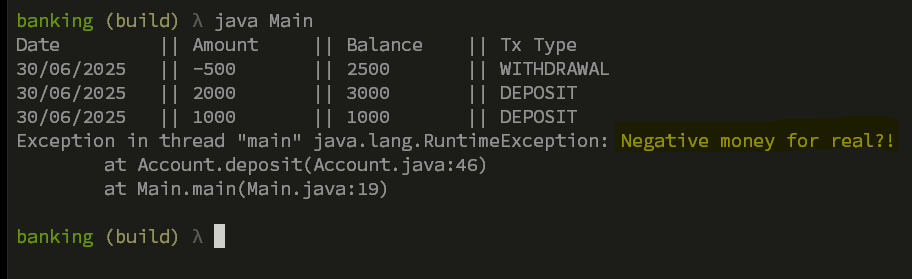

# Banking

A simple banking service built in plain Java.

---

## Overview

This is a Java project implementing the core functionalities of a banking system. It includes deposit, withdrawal, and transaction history features, following clean object-oriented design with encapsulated business logic, all without frameworks or external dependencies.

---

## Design Challenges

### Goal:
Build a minimal Java application that:
- Uses `ArrayList` for in-memory data storage.
- Includes a class `Account` that implements the core business logic of a banking system.

### Final Approach:

- `AccountStore`: Separate class holding the `ArrayList` of transactions.
- `Account`: Acts as both entity and business logic layer.
- `TransactionLog`: Represents a single transaction (type, date, amount, balance).
- `Main`: Used to create the account and simulate banking operations.

### Design Attempts:

1. **3-Tier Architecture (POJOs / Repository / Presentation)**  
   - Pros: Clean separation of layers.
   - Cons: Required both an `Account` entity and a separate `AccountService` implementation. Would have required renaming the entity (e.g., `AccountData`); too much structure for a simple app.

2. **All-in-One `Account` Class**  
   - Pros: Simple to wire up.
   - Cons: Messy — mixed data, logic, and storage responsibilities.

### Folder Structure:

    ├── Account.java
    ├── AccountService.java
    ├── AccountStore.java
    ├── TransactionLog.java
    ├── Main.java

---

## Features

- Deposit and withdrawal operations
- Transaction logging with timestamps, types, and balances
- Cleanly formatted bank statement via console
- Object-oriented structure using encapsulation

---

### Data Integrity & Error Handling

* **Deep Copying for Integrity**:
  To protect the integrity of stored data, objects such as `Account` are deep-copied when retrieved. This prevents unintended external modification of internal state.

* **Exception Handling**:
  Runtime errors such as invalid input or insufficient funds are handled using built-in `RuntimeException`, with custom messages to ensure clarity and control during execution.

## Testing

No unit tests yet.  
Possible next steps:
- Add a `libs/` folder with JUnit jars
- Write simple `AccountTest` class using either JUnit or a manual test runner.

Some screenshots of the execution:

1. Successful deposit



2. No Enough funds
  


3. Negative money
  


---

## How to Run

### Compile (manual, no Maven):

```bash
javac *.java
```

### Run the application:

```
java Main
```
---

## Notes

* The application is entirely self-contained, no external libraries required.
* Focused on logic correctness, clarity, and structure.
* A great starting point for extending into a fully layered system if needed.

